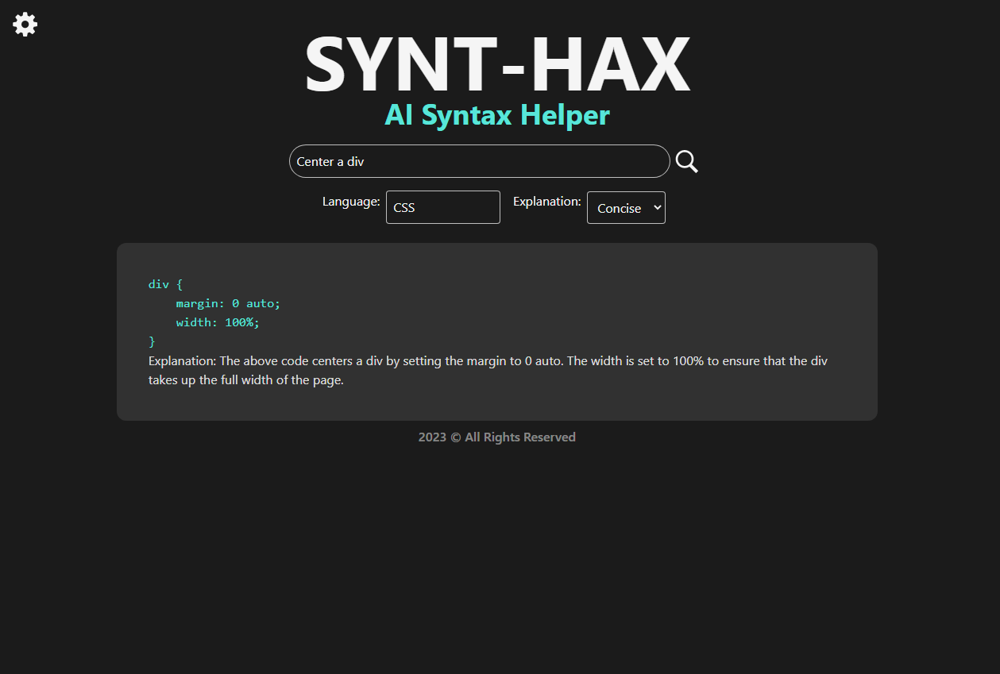

<h3 align="center">SYNT-HAX</h3>

  <a href="https://synt-hax.vercel.app/">Live Demo</a>

---

 SYNT-HAX provides developers with syntax suggestions and explanations. It helps users overcome syntax roadblocks and increase programming productivity.
      

## 📝 Table of Contents
- [About](#about)
- [Built Using](#built_using)
- [Author](#author)

## 🧐 About 
Synt-Hax is a React-based app that leverages OpenAI's language processing API to provide developers with syntax suggestions and explanations. It helps users overcome syntax roadblocks and increase programming productivity. The app uses ExpressJS and NodeJS for server-side communication and TailwindCSS for UI styling.

## ⛏️ Built Using 
- [React](https://react.dev/) - Web framework
- [Express](https://expressjs.com/) - Server Framework
- [NodeJs](https://nodejs.org/en/) - Server Environment
- [OpenAI API](https://platform.openai.com/docs/introduction) - API
- [TailwindCSS](https://tailwindcss.com/) - Styling

## ✍️ Author 
- [@realbcole](https://github.com/realbcole)
